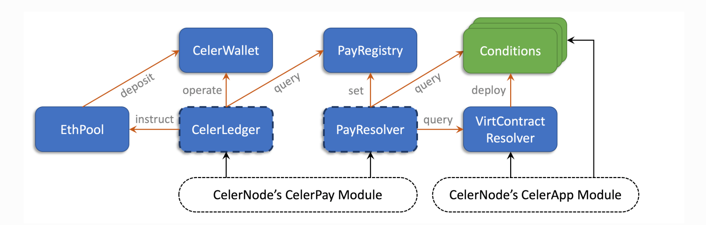

## Specification: オフチェーンでのデータアクセスコントロール権の合意形成アルゴリズム

**System Architecture**
Celer Channelはconditional paymentである。これは以下の３つの要素からなっている。CelerPay, CelerApp, CelerNode。

**CelerPay** は効率的なオフチェーン＊トークン送金をサポートする汎用ペイメントネットワークで、オンチェーンの検証可能なステートによって決済が行われる。これは一連のオンチェーンスマートコントラクトと、オフチェーンコミュニケーションプロトコルから構成される。共有されたスマートコントラクトは各々のチャンネルのピアに対して、必要最小限のオンチェーンステートを維持する。オフチェーンプロトコルはどのようにピアがオフチェンのステートをアップデート、交換するかと、いつオンチェーンのファンクションを呼ぶかを明示する。CelerPayチャンネルは、state channel networkのエッジに位置する。

**CelerApp**は任意のアプリケーションロジックを表現できるgeneric state channelsである。CelerPayに必要な標準クエリAPIを公開しているため、支払い条件をCelerAppの結果に基づいて設定できる。上の図の破線は、CelerAppがvirtual moduleにできる可能性を示している。アプリコントラクトは開発者が一度だけデプロイして、将来のプレイヤー全員が共有することができる。

**CelerNodes**はCelerPay及びCelerAppsのstate channelプロトコルを実行するエンドポイントである。ノードは、ネットワーク内の別のノードとCelerPayチャンネルを設定することで、state channel networkに参加できる。CelerNodeがネットワークに参加すると、ネットワーク内の他のノードにオフチェーンペイメントを送ることができる。

＊CelerPayとCelerAppは単純なconditional dependency interfaceを通してゆるくつながっている。これにより、CelerPayのユースケースは、state channelのアプリケーションをはるかに超えることができる。これはオンチェーン上にverifiable conditional stateが存在する限り、オンチェーン上で条件付き支払いをCelerPay network経由で行うことができるからである。オンチェーンのオラクルからの結果によって、条件付き支払いを行うことができる。

**Protobuf Messages**
異なるプラットフォームのCelerコンポーネントは同じセットのprotobufメッセージに対応する。これは次の４つのカテゴリーに分類される。
[chain.proto](https://github.com/celer-network/cChannel-eth/blob/master/contracts/lib/data/proto/chain.proto) はCelerPayオンチェーンスマートコントラクトとインタラクションするためだけに使われる。
[entity.proto](https://github.com/celer-network/cChannel-eth/blob/master/contracts/lib/data/proto/entity.proto)はオンチェーンとオフチェーンコミュニケーションためのCelerPay core data structuresを持つ。
[app.proto](https://github.com/celer-network/cApps-eth/blob/master/contracts/lib/proto/app.proto)はCelerAppのオンチェーンとオフチェーンコミュニケーションの両方に使われる。

**Contracts Architecture**

下部の白い破線のモジュールは、ユーザーオフチェーンのコンポーネントである。それぞれの色付きの長方形は、個々のオンチェーンコントラクトである、青色のモジュールはCelerPayコントラクト（破線で囲まれた者はアップグレード可能である）；グリーンモジュールは任意のcondition contracts；オレンジの矢印はコントラクト間のファンクション外部呼び出し；黒の矢印はCelerNodes(チェーン外のユーザー)からのファンクション外部呼び出しである。

**CelerWallet**
CelerWalletのコントラクトにより、全てのペイメントチャンネルに対して複数の所有者、複数のトークンのヲウォレットが維持される。CelerWalletは複雑なペイメントチャンネル＊ロジックを使用せずにチャンネルピアのトークンのみを保持する。これはCelerLedgerコントラクトにプログラムされている。このシンプルさのため、ロバストで安全である。ペイメントチャンネルのピア（CelerNodes）はトークンを操作するために直接CelerWalletコントラクトとインタラクトすることはない。ウォレットオペレータがこの操作を行う。

**CelerLedger**
CelerLedgerはCelerPayコントラクトの中心で、ほとんどの[on chain user operations](https://www.celer.network/docs/celercore/channel/pay_contracts.html#channel-operations)のエントリーポイントである。
これはCelerPayのオンチェーンステートマシンを定義し、ペイメントチャンネルのコアロジックを維持し、トークンアセットの操作するためのオペレーターとして振る舞い、ユーザー（channel peers)がペイメントチャンネルを管理できるように豊富な[APIs](https://github.com/celer-network/cChannel-eth/blob/master/contracts/lib/interface/ICelerLedger.sol)を提供する。CelerLedgerはロジックを実行するために、次の３つのコントラクトのファンクションを外部呼び出しする。：
*To CelerWallet: トークンをdeposit/withdraw、オペレータ権の転送するためのCelerWalletの操作
*To EthPool: CelerWalletにETHの転送、シングルトランザクションチャンネルオープンを可能にする。
*To PayRegistry: チャンネルで紛争解決した時に、resolved(紛争解決済みの)トークン量のクエリを行う。

**PayResolver**
PayResolverはペイメント紛争解決のロジックを定義する。これは二つの[APIs](https://github.com/celer-network/cChannel-eth/blob/master/contracts/lib/interface/IPayResolver.sol) からなる。もしピア同士がオフチェーンで協調的に決済の完了ができなかった時に、CelerNodeにオンチェーンで紛争解決を行わせる。PayResolverはロジックを実行する時に、次のコントラクトのファンクションを外部呼び出しする。
*To PayRegistry: resolved(紛争解決済みの)トークン量をグローバルペイメントインフォメーションレジストリにセットする。
*To Conditions: finalized(決済完了済みの)トークン量を計算した時に、condition結果をクエリする。

**Payregistry**
PayRegistryは全てのペイメントのresolved（紛争解決済みの）トークンを保管するためのグローバルレジストリである。これは誰でもpayment IDによって紐付けられているペイメント結果をセットするために、シンプルな[APIs](https://github.com/celer-network/cChannel-eth/blob/master/contracts/lib/interface/IPayRegistry.sol) を提供している。PayRegistryはpayment IDを `payID = Hash(Hash(pay), setterAddress)`として計算する。setterは基本的にPayResolverである。このように、各々のペイメント結果はresolver contract(field 8 of the [ConditionalPay message](https://www.celer.network/docs/celercore/channel/pay_contracts.html#conditional-payment)に特定性があるようにセットされている。ペイメント結果はPayRegistryでfinalized(決済完了済みの)にされると、改竄することができなくなり、可用性が保証される。これにより、決済が保留状態にある全てのチャンネルはレジストリに保管されている結果を参照することにより、オフチェーンまたはオンチェーンで決済を完了することができる。

**EthPool**
EthPoolはERC-20-likeなETHのためのシンプルなETHウォレットコントラクトである。
 
**Conditions**
ConditionsはCelerPayコントラクトのパートではなく、チャンネル内で紛争解決が行われている時に、PayResolverが`isFinalized()`と`getOutcome()`APIsを通してクエリする時のための外部コントラクトである。Conditionコントラクトは最初にオンチェーンにデプロイされる。

## Flows
このセクションはフローを説明する。

## PUBLISHERとCONSUMERが初めてオフチェーンでデータアクセスコントロール権の合意形成をするときで、両者が互いに協調的である時

**Depoly**
DID PUBLISHERはAccessSecretRegistry.solをデプロイする。このスマートコントラクトはオンチェーンオラクルとして利用される。オンチェーンオラクルとはオンチェーンでのデータは耐改竄性が保証されているため、この真正性のあるデータを用いて何らかの処理をオンチェーンで行うこと。このスマートコントラクトの結果に依存するconditional paymentを送信する。この結果は`isFinalized()`と`getOutcome()`である。`isFinalized()`と`getOutcome()`がtrueである時、PUBLISHERSはトークンを受け取ることができる。消費者がデータのアクセスコントロール権を持っていれば、`checkPermissions()`がtrueとなっている。`isFinalized()`と`getOutcome()`と`checkPermissions()`はAccessSecretRegistry.sol内の関数である。

**Open Channel**
CelerLedgerコントラクトは`openChannel()`APIを提供する。このAPIはシングルトランザクションでチャンネルをオープンにすることを可能にする。このAPIは一つのインプットを受け取る。これは両者のチャンネルピアによって署名された、payment channel initializer messageである。CelerLedgerコントラクトが正当なオープンチャンネルリクエストが受け取った時に、次のオペレーションを実行する。
1. CelerWalletコントラクトでウォレットを作成され、そのwalletIDは`Hash(walletAddress, ledgerAddress, Hash(channelInitializer))`として計算される。このwalletIDはchannel IDとしても使用される。
2. CelerLedgerコントラクト内のchannel stateは初期化される。
3. ブロックチェーンネイティブなトークン（ETH)とトランザクションリクエストが、許可されたトークンプール（e.g. EthPool or ERC20 contracts)からCelerWalletに送られる。CelerWalletでpayment channel initializer messageに記載されているトークン量が両者に分配される。

**Send Conditional Payment**
conditional paymentを送るということは両者に署名された[simplex channel state](https://www.celer.network/docs/celercore/channel/pay_contracts.html#simplex-channel-state) を作ることである。新しいエントリーがpending(保留中の)payId list(field 5)に加えられ、関連する他のフィールドがアップデートされる。プロセスの間、一つのラウンドトリップに二つのオフチェーンメッセージ（`CondPayRequest`と`CondPayResponse`)が含まれる。`CondPayRequest`は条件付き支払いを送信または転送したいピアによって送信されるシングルホップメッセージである。主な内容は次の通りである。
1. Payment data: 不変な[conditional payment](https://www.celer.network/docs/celercore/channel/pay_contracts.html#conditional-payment)メッセージがpayment sourceにセットされる。
2. New one-sig stae: 新しい [simplex state](https://www.celer.network/docs/celercore/channel/pay_contracts.html#simplex-channel-state)`peer_from`からの署名を保持する。この新しいstateはより高いsequence numberを持たなければならず、新しいpending(保留中の)payID list (field 5)に新しいconditional payment IDとアップデートされたチャンネルのメタデータ(field 6とfield 7)を持つべきである。
3. Base seq: previous sequence number
4. Pay note: `google.protobuf.Any`の形式のpayment note。オフチェーンコミュニケーションで役にたつあらゆる情報を格納できる。

**`CondPayResponse`** は受け取ったピアがリクエストの全てのデータフィールドを検証してから送ったピアに送り返すメッセージである。レスポンスは次の二つのフィールでの項目からなる。
1. Co-Signed state（両者に署名されたstate): 最後に両者に署名された[simplex state](https://www.celer.network/docs/celercore/channel/pay_contracts.html#simplex-channel-state)。もし、リクエストが正当であるならば、`CondPayRequest`の中のstateは同じであるべきである。他の場合、(e.g.パケットロスによる、正当でないsequence number)、受け取ったピアによって格納された最後の両者に署名されたstateが障害回復をするために,`peer_from`に返される。

**Send State Proof Request(state is key of did)**
[StateProof](https://github.com/celer-network/cApps-eth/blob/master/contracts/lib/proto/app.proto)を送ることにより、両者に署名されたstateを作成する。
これは次の情報により成り立つ。
1. New one-sig state: `peer_from`から署名された新しいstate。この新しいstateはより高いsequence numberを持たなければならない。stateは`didList(did(bytes32) => key(uint8))`のkeyである。
2. seq: previous sequence number

**`StateProofResponse`**は受け取ったピアがリクエストの全てのデータフィールドを検証してから送ったピアに送り返すメッセージである。レスポンスは次の二つのフィールドからなる。
1. Co-Signed state(両者に署名されたstate)：両者に署名されたstate
2. Error: ある任意のerror reason か sequence number error

**intendSettle(state is key of did)**
off-chain stateをオンチェーンのアップデートをするために提出、決済をする。オンチェーンで両者に署名されていて、stateが正当であれば、`isFinalized()`,`getOutcome()`,`checkPermissions()`の結果がtrueになる。

**Settle Conditional Payment**
conditonal payment が正しくセットアップされた時、オフチェーンでfinalizedなconditionの結果により協働的に決済を完了することができる。オフチェーンでのconditional paymentの決済完了は新たに両者に署名された[simplex channel state](https://www.celer.network/docs/celercore/channel/pay_contracts.html#simplex-channel-state) を作ることにより行われる。pending(保留中の) payId list(field 5)のエントリーが削除され、転送されたトークン量(field 4)と他の関連するフィールドがアップデートされる。

`PaymentSettleRequest`はオフチェーンでチャンネル内の決済を完了をする時、`peer_from`から送られるメッセージである。これは以下の情報により更新される。
1. Payment to be settled: 決済完了されるpayment　IDのリスト、決済完了の理由（e.g.fully paid, expired, rejected, on-chain resolved)、決済完了済みのトークン量。
2. New one-sig state: `peer_from`に署名された新しい[simplex state](https://www.celer.network/docs/celercore/channel/pay_contracts.html#simplex-channel-state)。この新しいstateはより高いsequence number(field 3)と新しいpending(保留中の) payId list (field 5) (決済完了されたペイメントが削除されている)を保持し、転送されたトークン量(field 4)とtotal pending amountが更新されている。
3. Base seq: the sequence number of the previous simpelx state 

**`PaymetSettleResponse`**は受け取ったピアがリクエストの全てのデータフィールドを検証してから送ったピアに送り返すメッセージである。レスポンスは次の二つのフィールドからなる。
1. Co-Signed state(両者に署名されたstate)：両者に署名されたstate
2. Error: ある任意のerror reason か sequence number error

##　PUBLISHERが不正な処理をしたCONSUMERをオンチェーンで紛争解決をしたい場合

**CONSUMERがAccessSecretRegistry.solの`intendSettle()`を呼び出した後に、`PaymentSettleRequest`を送信しなかった場合か、`PaymentSettleRequest`が送信されなかった場合である。**
**Resolve Payment by Condition**
もし受け取ったsettlementメッセージが期待されたものでなかった場合、PUBLISHERはconditionのペイメントがオンチェーンでfinalizedな場合、オンチェーン上の`resolvePaymentByCondtions()`を呼び出すことで紛争解決をすることができる。`resolvePaymentByConditions()`APIはインプットとして二つの情報を受け取る。1) 全てのconditional payment data , 2)ペイメントに関連つけられている全てのhash preimages PayResolverは全てのhash preimagesを検証し、conditionsの結果をクエリし、計算し、ペイメント結果をPayRegistryにセットする。 PUBLISHERは決済完了を申し込むため、CONSUMERに`PaymentSettleProof`を送信しなければならない。　`PaymentSettleProof`は決済完了プロセスの初期化をするために使用される。オンチェーンでペイメントの紛争解決が行われ、不正証明が正しいと証明された後に、CONSUMERが協働的になった場合、CONSUMERは正当な`PaumentSettleRequest`を送り、PUBLISHERは`PaymentSettleResponse`を返すことになる。

**オンチェーンで紛争解決が行われて、不正証明が正しいと証明された後でもCONSUMERかPUBLISHERが協働的でない場合**

**Settle/Close the payment channel**
もし協働的な決済完了が不可能である場合、PUBLISHERはオンチェーン上に`intendSettle()`APIを呼び出すことで、一方的な決済完了を行うことができる。このAPIは両者に署名されたオフチェーンsimplex stateをインプットとして受け取る。CelerLedgerコントラクトはsimelex statesとPayRegistryからクエリされたpendingペイメントの結果を元に、分配されるトークン量を計算する。
不正な一方的な決済完了リクエストが送られ、challenge windowが空いている場合、両者に署名されていて、より高いsequence　numberを持つメッセージを不正証明として送ることで紛争解決を行う。challenge windowが閉じた場合、`confirmSettle()`APIを呼ぶことでチャンネルを閉じる。

##  PUBLISHERとCONSUMERが他のデータのアクセスコントロール権の売買の合意形成をした場合

REQUIREMENT: conditional ペイメントアプリケーションのセキュリティーリスクはconditionの`isFinalized()`と`getOutcome()`に依存するため、これらを意図せずアップデートするべきではない。

Set another DID.
PUBLISHERはオンチェーン上の `setDID()`を呼ぶことで他のデータのDIDを登録する。

Send State Proof Request (state is -2)
CONSUMERが`intendSettle()`(stae is -2)で呼び出した時、AccessSecretRegistryコントラクト上のステータスは`AppStatus.FINALIZED`から `AppStatus.IDLE`に変わる。

##  PUBLISHERとCONSUMERのオンチェーンのポジションを入れ替えたい場合

REQUIREMENT: conditional ペイメントアプリケーションのセキュリティーリスクはconditionの`isFinalized()`と`getOutcome()`に依存するため、これらを意図せずアップデートするべきではない。

Send State Proof Request (state is -1)
CONSUMERが`intendSettle()`(stae is -1)で呼び出した時、AccessSecretRegistryコントラクト上のポジションであるownerとgranteeが入れ替わる。